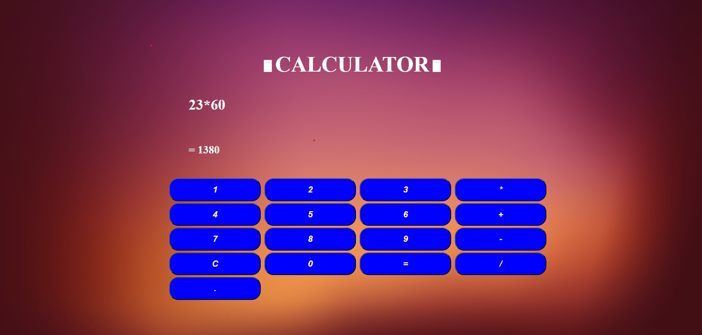

<h1 align="center">🧮 Simple Calculator</h1>

A beginner-friendly calculator built using HTML, CSS, and JavaScript. This project demonstrates how to implement basic arithmetic operations in a clean and responsive user interface. Perfect for learning and experimenting with front-end web development!

---

## Made with
|HTML|CSS|Javascript|
|---|---|---|

---

**Functionality**
1. Buttons to type number
2. Buttons to add, subtract, multiply and divide
3. Button to clear everything

---

## ✨ Features

- Perform basic arithmetic operations: addition, subtraction, multiplication, division
- Clear and modern user interface
- Responsive design for desktop and mobile screens
- Keyboard and button input support

---

## 🛠️ Installation

To run this project locally, follow these steps:

1. **Clone the repository:** `git clone https://github.com/Axe-Pearl/Mini-Projects.git`

2. **Navigate to the project folder:** `cd Mini-projects`

3. **Open the Calculator folder:**
    Double-click on the Calculator project

4. **Open the index.html file in your browser:**
    Double-click index.html

## Usage

Once opened in the browser:

Click the on-screen number and operator buttons to build a calculation.

Press = buton to evaluate.

 <h3 align="center">Hope this application helpful to you !!</h3>